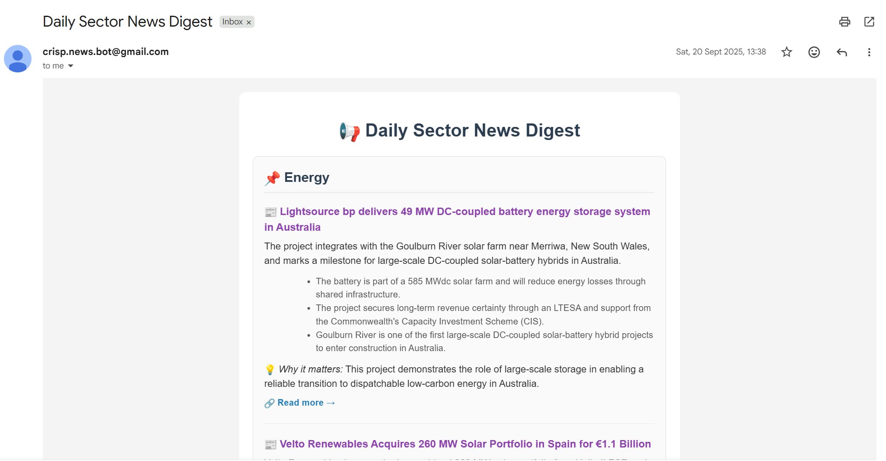

# Sector News Bot

A simple project that collects sector news from many sources, summarizes what happened yesterday, and sends a short email digest.

Summary
This project fetches RSS and article content, uses a local model to pick and summarize important stories, and builds an HTML daily newsletter. It is meant for people who want a quick, reliable summary of yesterday's sector news without reading many articles.

Problem

People are not reading the news regularly because there is too much content and it takes time to find what matters. Existing newsletters can be noisy, long, or focused on other agendas. I built this bot to give a short, neutral, and sector-focused summary of what happened yesterday so busy readers can catch up fast.

User pain points

- Too many articles to scan each day.
- No clear summary of the most important events per sector.
- News emails are long and take time to read.
- People miss key events because they do not have time to filter sources.
- Users want a trustworthy quick snapshot they can scan in a minute.

Approach

1. Collect news from many RSS sources per sector using the scraper module.
2. Store raw items in a local SQLite database so data is persistent.
3. Use a local small LLM helper to rank and pick the top headlines for each sector.
4. Fetch full article text for the chosen headlines and summarize them with the local model.
5. Assemble an HTML email digest with short summaries and links to the full articles.
6. Send the digest or write it to a file so users can preview or email it.

Key features

- Multi-source RSS scraping
- Local storage in SQLite
- Headline ranking with a local model
- Article fetch and summarization
- HTML newsletter generation and sending

File map

- bot.py — top level orchestration to run the full pipeline
- scraper.py — fetch RSS and basic HTML cleaning
- db.py — SQLite schema and persistence helpers
- llm_local.py — local model calls and headline ranking
- summarizer.py — fetches article text and creates summaries
- emailer.py — builds HTML newsletter and sends email
- docs/ — documentation (this file)
- .env — local secrets (do not commit)

